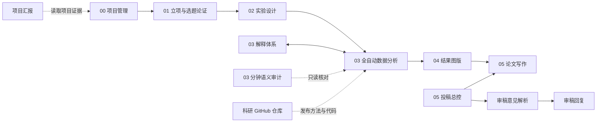

# Research Codex Skills｜科研全流程 Codex Skills

[English](README.en.md) · [MIT License](LICENSE)

一套面向科研论文项目的、中文优先的 Codex Skills。它覆盖项目管理、立项论证、实验设计、数据分析、结果图版、论文写作、审稿回复、项目汇报和科研代码仓库发布，并把权限边界、可复现性与科研语义审计作为一等约束。

本仓库目前包含 **13 个可独立安装的 Skill**。它们可以单独使用，也可以组成一条完整科研工作流。

> [!IMPORTANT]
> 这是社区维护的开源项目，不是 OpenAI 官方 Skill 集。使用者仍应对研究设计、统计方法、结果解释、引用准确性和最终论文承担专业审阅责任。

## 工作流概览



这张图表示推荐协作关系，不表示每个项目都必须依次执行全部 Skill。

## Skill 清单

| Skill | 作用 | 默认调用方式 |
| --- | --- | --- |
| `manage-research-project` | 初始化项目骨架、维护 `PROJECT.md`、安全接入外部材料 | 显式调用 |
| `research-project-framing` | 收敛核心研究问题、缺口、Novelty 与预期贡献 | 显式调用 |
| `research-study-design` | 把研究问题展开为故事、证据、主技术路线、数据和图设计 | 自动发现或显式调用 |
| `data-analysis-explanation` | 维护“单元库 → 汇总表 → txt”解释体系 | 显式调用或由分析流程交接 |
| `data-analysis-auto` | 完成解释准入、规划、分析、绘图、复现和结果同步 | 自动发现或显式调用 |
| `data-analysis-audit` | 逐分钟只读审计任务说明、规划表与业务源码是否语义互通 | 自动发现或显式调用 |
| `build-research-figures` | 从 02 证据和 03 SVG 单图规划、组装、微调 Fig 并生成图注 | 显式调用 |
| `05-sci-publish` | 检查投稿阶段并路由到论文或审稿子 Skill | 显式调用 |
| `05-sci-manuscript-writing` | 持续撰写、修改和格式化稿件，管理图表与引文 | 显式调用 |
| `05-sci-reviewer-parsing` | 把审稿意见解析为中文分类清单并定位稿件位置 | 显式调用 |
| `05-sci-reviewer-response` | 起草和维护审稿回复信 | 显式调用 |
| `build-research-presentations` | 从项目材料制作可编辑的科研汇报 PPT | 自动发现或显式调用 |
| `github-research-repo` | 建立、审计和发布读者可复现的科研方法与代码仓库 | 显式调用 |

## 安装

### 方法一：让 Codex 使用 `skill-installer` 安装

安装单个 Skill 时，在 Codex 中输入：

```text
$skill-installer 从 https://github.com/Cris-du/research-codex-skills/tree/main/skills/manage-research-project 安装这个 Skill
```

安装整套 Skills 时，可以把下面这段直接交给 Codex：

```text
$skill-installer 从 Cris-du/research-codex-skills 的 main 分支安装以下路径：
skills/manage-research-project
skills/research-project-framing
skills/research-study-design
skills/data-analysis-explanation
skills/data-analysis-auto
skills/data-analysis-audit
skills/build-research-figures
skills/05-sci-publish
skills/05-sci-manuscript-writing
skills/05-sci-reviewer-parsing
skills/05-sci-reviewer-response
skills/build-research-presentations
skills/github-research-repo
```

### 方法二：克隆仓库并使用安装器

```bash
git clone https://github.com/Cris-du/research-codex-skills.git
cd research-codex-skills
python scripts/install.py
```

默认安装到：

- 已设置 `CODEX_HOME`：`$CODEX_HOME/skills/`
- 未设置 `CODEX_HOME`：`~/.codex/skills/`

只安装指定 Skill：

```bash
python scripts/install.py --skill data-analysis-auto --skill data-analysis-explanation
```

指定安装目录：

```bash
python scripts/install.py --dest /absolute/path/to/codex/skills
```

安装器不会覆盖已存在的同名目录；如果检测到冲突，会在复制任何文件前停止。安装完成后，请新建一个 Codex 任务，使 Skill 清单重新加载。

### 方法三：手动安装

把 `skills/<skill-name>/` 整个目录复制到：

```text
<CODEX_HOME>/skills/<skill-name>/
```

不要只复制 `SKILL.md`。`agents/`、`scripts/`、`references/` 和 `assets/` 都可能是运行所需资源。

## 路径配置

公开版不包含作者电脑的盘符、用户名或同步盘路径。需要路径的 Skill 使用以下可更换配置。

### 1. `RESEARCH_PROJECTS_ROOT`

推荐设置。它应指向“包含一个或多个科研项目目录的父目录”，而不是某个 Skill 目录。

例如：

```text
<RESEARCH_PROJECTS_ROOT>/
├── project-a/
├── project-b/
└── project-c/
```

Windows PowerShell，设置当前会话：

```powershell
$env:RESEARCH_PROJECTS_ROOT = 'D:\Research\Projects'
```

Windows PowerShell，写入用户级环境变量：

```powershell
[Environment]::SetEnvironmentVariable(
    'RESEARCH_PROJECTS_ROOT',
    'D:\Research\Projects',
    'User'
)
```

macOS/Linux：

```bash
export RESEARCH_PROJECTS_ROOT="/data/research/projects"
```

设置持久环境变量后，请重启 Codex。没有设置时，相关 Skill 只会在当前工作区内尝试从固定项目骨架推导；候选不唯一时会停下来询问，不会扫描整台电脑。

### 2. `RESEARCH_PLOT_LIBRARY_ROOT`（可选）

如果你有自己的 R 绘图模板库，可把它指向该模板库：

```powershell
$env:RESEARCH_PLOT_LIBRARY_ROOT = 'D:\Research\PlotLibrary'
```

```bash
export RESEARCH_PLOT_LIBRARY_ROOT="/data/research/plot-library"
```

兼容的模板库可以包含：

```text
<RESEARCH_PLOT_LIBRARY_ROOT>/
├── Rscript_exe.txt   # 可选：每行一个 Rscript 绝对路径
├── R.txt             # 可选：模板使用的 R 包库候选
└── ...               # 你自己的绘图模板
```

没有共享绘图库时，`data-analysis-auto` 会要求在当前分钟任务内生成参数化、单图、可复现的 R 脚本，不会引用作者的私有模板库。

### 3. `RESEARCH_RSCRIPT`（可选）

如果 `Rscript` 不在 `PATH`，可直接指定其可执行文件：

```powershell
$env:RESEARCH_RSCRIPT = 'D:\R\bin\Rscript.exe'
```

```bash
export RESEARCH_RSCRIPT="/opt/R/bin/Rscript"
```

R 运行时按以下顺序选择：

1. `RESEARCH_RSCRIPT`；
2. 可选共享绘图库中的 `Rscript_exe.txt`；
3. 当前 `PATH` 中的 `Rscript`。

## 项目骨架

这套 Skills 对项目内部结构有明确约定。`RESEARCH_PROJECTS_ROOT` 可以位于任何磁盘或目录，但每个项目建议使用下面的骨架：

```text
<RESEARCH_PROJECTS_ROOT>/<项目名>/
├── PROJECT.md
├── 01_立项与选题论证.md
├── 02_实验设计.md
├── 03_数据与分析/
│   ├── skill化工作记录/
│   ├── 非skill化工作台/
│   ├── 主库/
│   └── 主库备份/
├── 04_结果主库/
├── 05_论文全周期/
├── 项目汇报/
└── Git/
```

可以显式调用 `$manage-research-project`，让它先只读展示初始化计划；只有在你确认后，它才会创建骨架。

## 运行依赖

| 能力 | 依赖 |
| --- | --- |
| 基础 Skill 使用 | 支持 Skills 的 Codex 环境 |
| 随附 Python 工具 | Python 3.10 或更高版本；仅使用标准库 |
| `data-analysis-auto` 流水线 | PowerShell 5.1+ 或 PowerShell 7、Python；绘图任务还需 R/Rscript |
| Excel 规划表和解释汇总表 | Codex 的 Spreadsheets 能力 |
| DOCX 稿件与审稿回复 | Codex 的 Documents 能力；Zotero 为可选连接 |
| PPTX 项目汇报 | Codex 的 Presentations 能力 |
| GitHub 科研代码仓库 | Git、GitHub 连接或已认证的 GitHub CLI |

不同 Skill 的依赖相互独立。例如，只使用立项论证和实验设计时，不需要安装 R。

## 使用示例

```text
$manage-research-project 为这个新项目建立标准骨架，先只读展示计划。
```

```text
$research-project-framing 帮我把这个研究想法收敛成可写入 01 的核心问题和 Novelty。
```

```text
$data-analysis-auto 使用当前项目的样本信息与丰度单元完成差异分析。
```

```text
$build-research-figures 根据 02 的证据链和 03 的 SVG 单图规划 Fig 1。
```

```text
$05-sci-manuscript-writing 打开当前项目的论文写作工作台。
```

## 更新与卸载

安装器为了保护本地定制，不会覆盖现有 Skill。更新前请先审阅新版差异，再备份或移走旧的同名 Skill 目录，然后重新安装。

卸载时，只删除你确认属于本仓库的对应目录：

```text
<CODEX_HOME>/skills/<skill-name>/
```

不要递归删除整个 `skills/` 或 `CODEX_HOME`。

## 安全与隐私

- 不要把真实数据、未发表结果、患者信息、样本隐私、访问令牌或 `.env` 文件提交到公开仓库。
- `github-research-repo` 的公开审计只是一道技术门禁，不能替代人工的数据与知识产权审查。
- 使用数据分析和论文 Skills 前，请确认你拥有相应数据、文献、图片、模板和第三方代码的使用权。
- 发现安全问题时请阅读 [SECURITY.md](SECURITY.md)，不要在公开 Issue 中粘贴密钥或私人数据。

## 开发与验证

```bash
python scripts/validate_skills.py
python -m compileall -q skills scripts
```

贡献前请阅读 [CONTRIBUTING.md](CONTRIBUTING.md)。

## 许可证

本仓库采用 [MIT License](LICENSE)。第三方工具、数据、文献、字体和模板仍遵循各自许可证。
